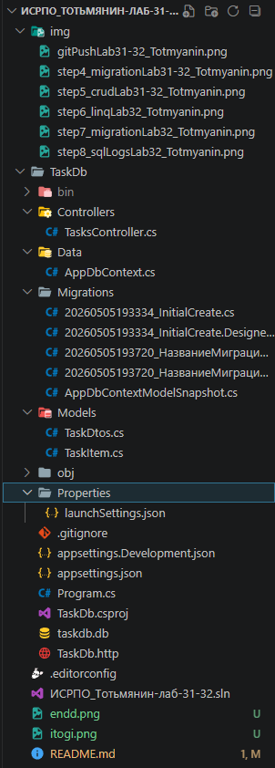
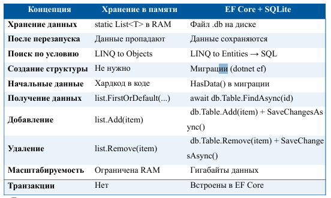
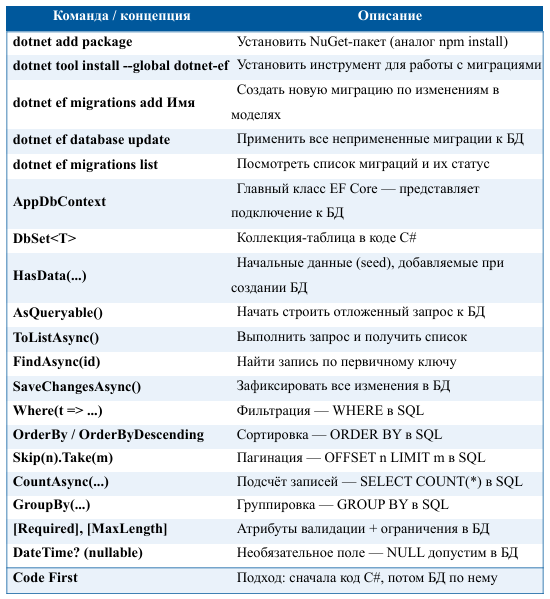

# Лабораторная работа №31-32. Введение в SQLite и Entity Framework Core

P.S: НИ В КОЕМ СЛУЧАЕ ЭТА РАБОТА И ВСЕ ПОСЛЕДУЮЩИЕ И ПРЕДЫДУЩИЕ НЕ НАПИСАНЫ С ПОМОЩЬЮ GPT И ТОМУ ПОДОБНОЕ!!! (ну практически, кроме README.md)

## Основная информация

- **ФИО:** Тотьмянин Тихон Алексеевич

- **Группа:** ИСП-232

- **Дата:** 05.05.2026  

## Описание работы

В ходе лабораторной работы изучены основы работы с базами данных в ASP.NET Core приложениях. Реализовано хранение данных не в оперативной памяти, а в полноценной базе данных SQLite с использованием ORM Entity Framework Core. Освоен подход Code First для создания структуры БД через миграции, изучены LINQ-запросы для фильтрации, сортировки, пагинации и агрегации данных.

## 💡 Главные выводы

1. **EF Core — это переводчик между C# и SQL.** Вы пишете LINQ-запросы на C#, а Entity Framework Core автоматически преобразует их в SQL-запросы к базе данных. Это избавляет от необходимости писать SQL вручную и снижает риск ошибок.

2. **Миграции — это система контроля версий для структуры БД.** Так же, как Git отслеживает изменения в коде, миграции отслеживают изменения в структуре базы данных. Каждый файл миграции содержит инструкции `Up()` (применить) и `Down()` (откатить), что позволяет команде разработчиков синхронно обновлять БД.

3. **Code First удобнее, чем писать SQL вручную.** Подход Code First позволяет описывать структуру данных через классы C#, а EF Core автоматически создаёт и обновляет таблицы. Изменил класс → создал миграцию → база обновлена. Не нужно писать `ALTER TABLE` вручную.

4. **SaveChangesAsync() — ключевой момент.** До вызова этого метода все изменения (добавление, обновление, удаление) живут только в памяти EF Core. Только при вызове `SaveChangesAsync()` изменения фиксируются в базе данных через SQL-запросы `INSERT`, `UPDATE`, `DELETE`.

5. **async/await при работе с БД — это стандарт.** Запросы к базе данных занимают время, и блокировать поток сервера на время ожидания — плохая практика. `async/await` позволяет серверу обрабатывать другие запросы, пока один ждёт ответа от БД. Это та же концепция, что и в JavaScript.

6. **LINQ предоставляет мощные возможности для работы с данными.** Методы `Where()`, `OrderBy()`, `Skip()`, `Take()`, `GroupBy()`, `CountAsync()` позволяют гибко фильтровать, сортировать, группировать и агрегировать данные без написания сложных SQL-запросов.

## Структура проекта



## Запуск

```bash
cd TaskDb
dotnet restore
dotnet run
```

## Итоговая таблица



## Итоговая таблица: что изучили в лабораторной


